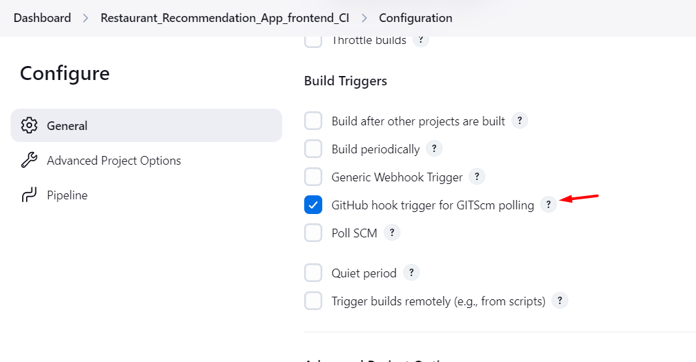

### prerequisite:

  * Install Java in your local machine.
  * Install Jenkins in your local machine.
  * Install docker-desktop in your local machine and open the docker-desktop. Since we are not using any agent, so all the pipeline steps will be running from our local machine. We can use docker agent to run this pipeline which is a best practice. But for this project we are not using any agent.

1. Create a Jenkins pipeline Project.
2. In Manage plugins --> Install `Generic Webhook Trigger` plugin
3. Read this Document for Github Webhook Configuration -->  `https://www.geeksforgeeks.org/what-is-webhooks-in-jenkins/` (or) `https://medium.com/@sangeetv09/how-to-configure-webhook-in-github-and-jenkins-for-automatic-trigger-with-cicd-pipeline-34133e9de0ea`

4. Install ngrok in your local machine.  --> Because when we configure `http://localhost:8080//github-webhook/` as a payload URL in github webhook trigger it will not work, so we are using ngrok to resolve this issue. When we install ngrok we will get ngrok url. we need to use that `{ngrok-url}//github-webhook/` as a payload URL in github webhook trigger. if we created jenkins in remote server like Ec2, Azure Vm then we can directly use the Elastic Ip (or) Public Ip address of the Remote server Instead of ngrok. Since In our case jenkins is running in our local machine. So we are following this method.

5. Ngrok Installation Commands:

    * Open ngrok official website --> sign in and open the commands and run it in powershell terminal (Admin mode)
    * Follow the Below Screenshot image.

### Images:

6. copy the ngrok url and paste that url along with "//github-webook/" in github webhook settings.

### Images:

7. Jenkins Pipeline Configuration:

  * Configure Github and Docker Credentials in Manage Jenkins under credential manager.

  ### Images:

  

  

  * Configure Global Variable in Manage Jenkins Under Settings.

  ### Images:

  

  * Pipeline Configuration Steps.

  ### Images:

  

  

### Checking:

1. Now when you do (or) commit any changes in your code. The Jenkins Pipeline will automatically trigger and run the pipeline.

  ### Images:

  

### Note:

1. You can also add additional steps in the pipeline like static code analysis using sonarqube, docker image scanning using trivy. 