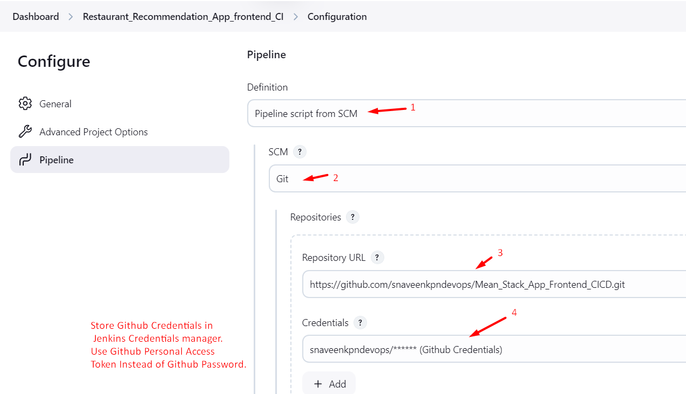

1. Create a Jenkins pipeline Project.
2. In Manage plugins --> Install `Generic Webhook Trigger` plugin
3. Read this Document for Github Webhook Configuration -->  `https://www.geeksforgeeks.org/what-is-webhooks-in-jenkins/` (or) `https://medium.com/@sangeetv09/how-to-configure-webhook-in-github-and-jenkins-for-automatic-trigger-with-cicd-pipeline-34133e9de0ea`

4. Install ngrok in your local machine.  --> Because to trigger localhost:8080 from github it needs some addditional configuration. 
5. Ngrok Installation Commands:

    * Open ngrok official website --> sign in and open the commands and run it in powershell terminal (Admin mode)
      --> 

### Images:

6. copy the ngrok url and paste that url along with "//github-webook/" in github webhook settings.

### Images:

7. Jenkins Pipeline Configuration:

  * Configure Github and Docker Credentials in Manage Jenkins under credential manager.

  ### Images:

  

  

  * Configure Global Variable in Manage Jenkins Under Settings.

  ### Images:

  

  * Pipeline Configuration.

  ### Images:

  

  
