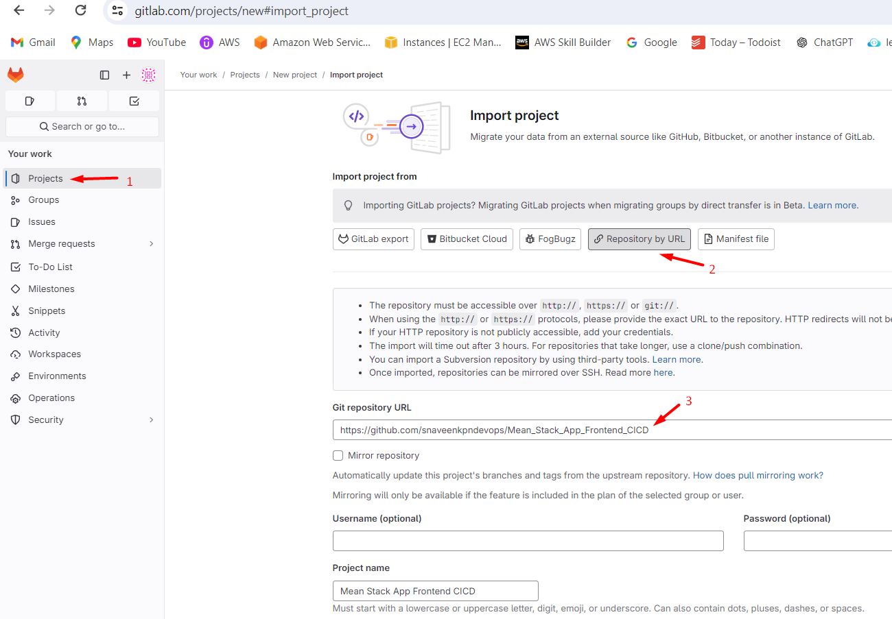
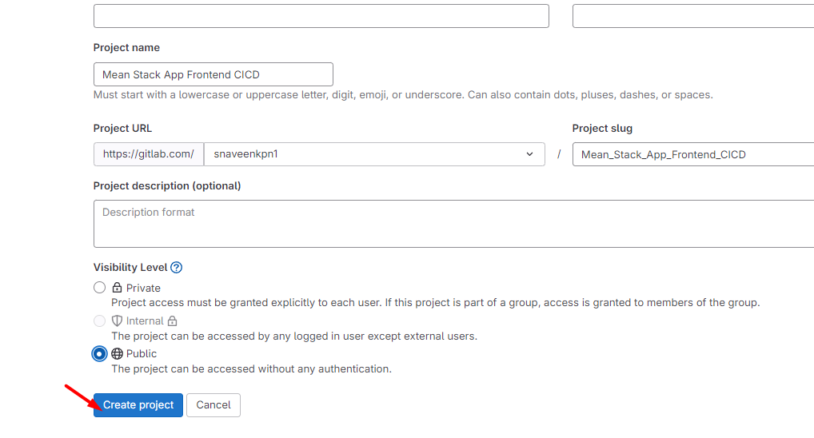
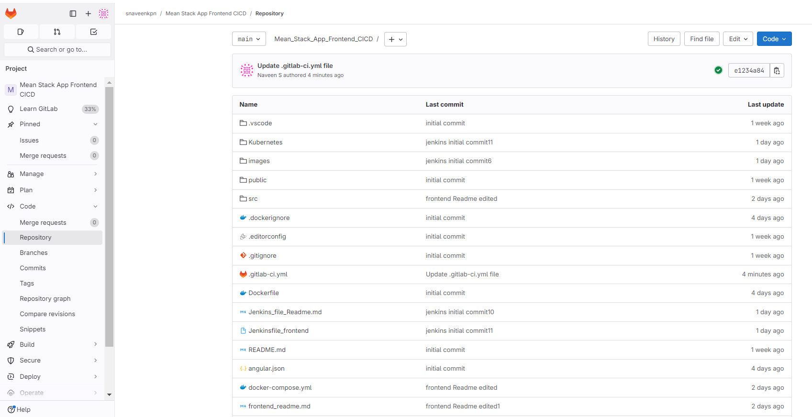
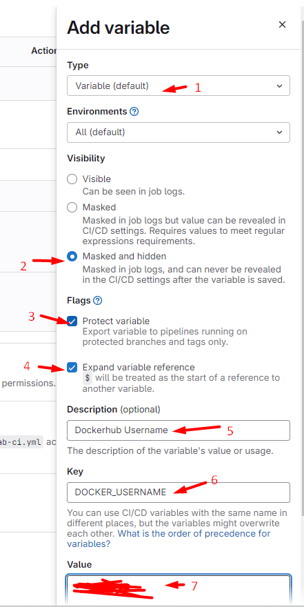
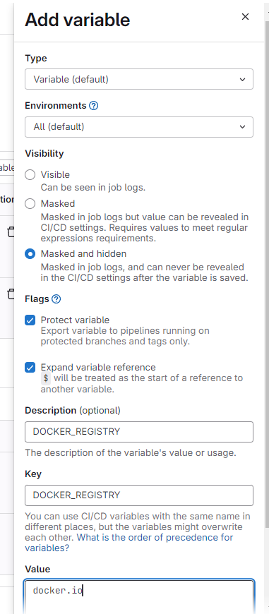
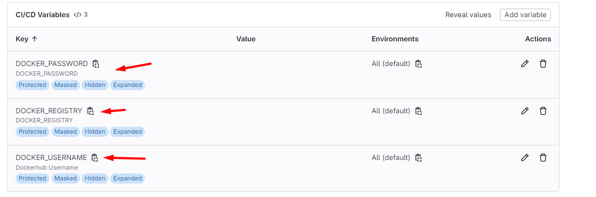
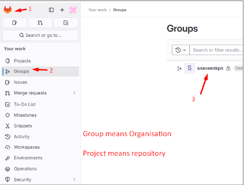
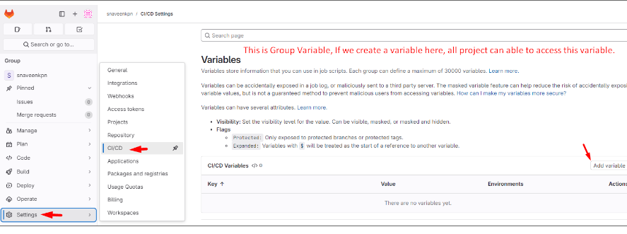

## Gitlab CI Pipeline Frontend

1. Open Gitlab --> create a new project. --> Create a import project [we are going to import github repo to gitlab.]


### Images:





2. Now all code from github repo will be imported to gitlab.

### Images:



3. Create gitlab pipeline file  -->  `.gitlab-ci.yml`. In this file we are going to build, push the docker image and then update the docker image tag in  Kubernetes manifest file.

    ```
    stages:
    - build_push
    - update_manifest

    variables:
    IMAGE_NAME: "${DOCKER_REGISTRY}/${DOCKER_USERNAME}/restaurant-frontend"  # Custom image name
    TAG: "${CI_COMMIT_REF_SLUG}-${CI_PIPELINE_IID}"  # Combine branch name and pipeline ID

    # Stage 1: Build and Push Docker Image
    build-and-tag-image:
    stage: build_push
    image: docker:latest
    services:
        - docker:dind  # Docker-in-Docker service
    script:
        - docker login -u "$DOCKER_USERNAME" -p "$DOCKER_PASSWORD"
        - docker build -t "$IMAGE_NAME:$TAG" .  # Build the Docker image
        - docker push "$IMAGE_NAME:$TAG"  # Push the image to the registry
    only:
        - main

    update-kubernetes-manifest:
    stage: update_manifest
    image: busybox:latest  # Using a light-weight image for simple file manipulation
    script:
        - echo "Updating Kubernetes frontend manifest with new image tag..."
        - 'sed -i "s|image: .*/restaurant-frontend:.*|image: ${DOCKER_REGISTRY}/${DOCKER_USERNAME}/restaurant-frontend:${TAG}|" Kubernetes/frontend.yaml'
        - cat Kubernetes/frontend.yaml  # Optional: Print the updated Kubernetes manifest for verification
        #- kubectl apply -f Kubernetes/frontend.yaml  # Apply the updated manifest to Kubernetes
    only:
        - main
    dependencies:
        - build-and-tag-image  # Ensure this job runs after build-and-tag-image


    ```

4. Before Running the Pipeline we need to create `environment variables` for this project. For this go to `project setting` --> click `ci/cd`-->  Inside `variable` dropdown --> Add variables.

### Images:

   



 


Instead of `project variable` we can also use `Group variable (Global variable)`

### Images:

   



   


 